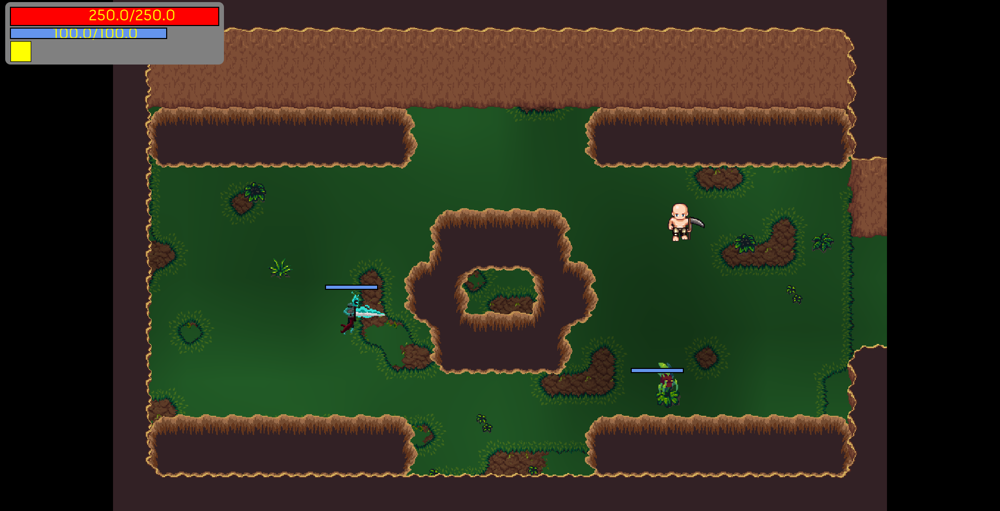
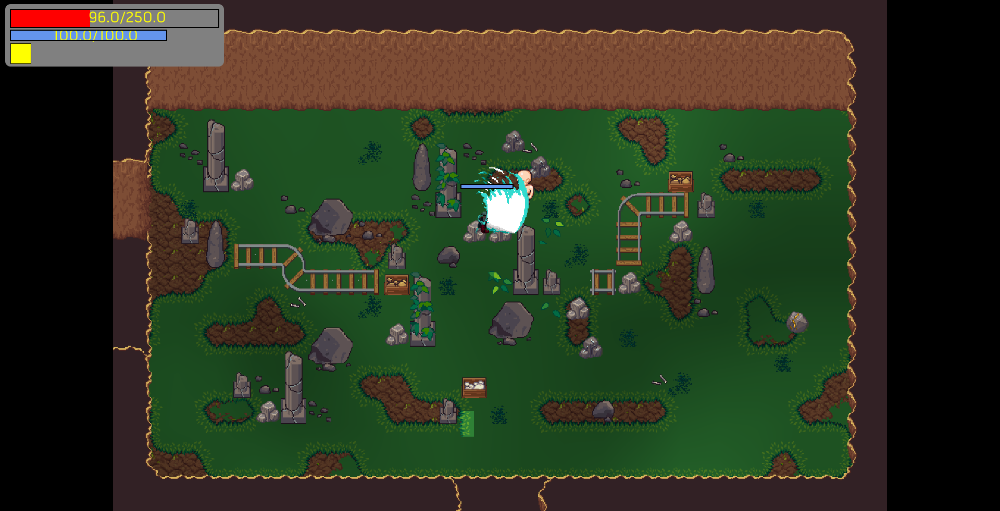

# DungeonCrawler

It's a simple dungeon crawler game made in Java using LWJGL.
I made this game to learn more about game development and to have fun.

## How to play

Basic controls:
- QZWD to move
- Space to teleport
- Tap to open a minimap
- A to attack

## Features

Each dungeon is composed of multiple rooms. And each room can have 1 to 4 doors that lead to other rooms.
They are a lot of different rooms that can be generated.
It's not procedural generation because I made patterns by myself.

The game is limited but I achieved to implement some features:
- Randomly generated dungeon
- Basic enemies (IA broken)
- Small teleportation (press the space bar)
- Basic combat system

## Screenshots

## Technical details

I used LWJGL with the following libraries:
- STB for image loading
- JOML for math
- NanoVG for UI rendering
- OpenGL for rendering
- GLFW for window management

I also create a small lib on top of GLFW and NanoVG to create a swing like UI system.

